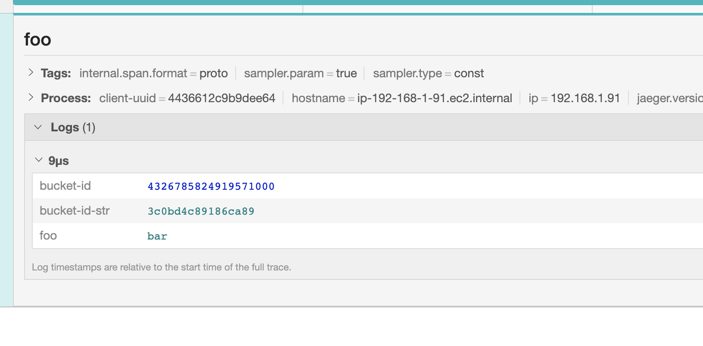

# WTF



The number `4326785824919571000` is not the decimal representation of `0x3c0bd4c89186ca89`.

Proof:

```console
$ printf "%x\n" 4326785824919571000
3c0bd4c89186ca38
```

(Yes I tried other tools, from python repl to go playground to check the conversion)

